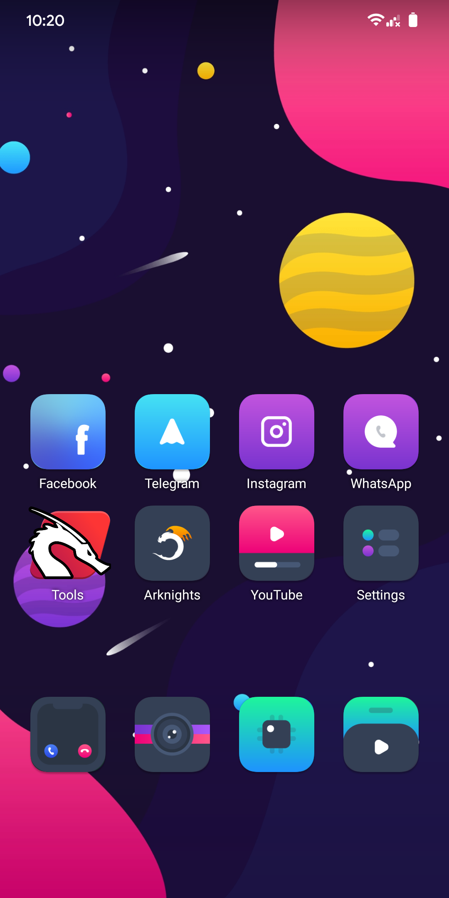
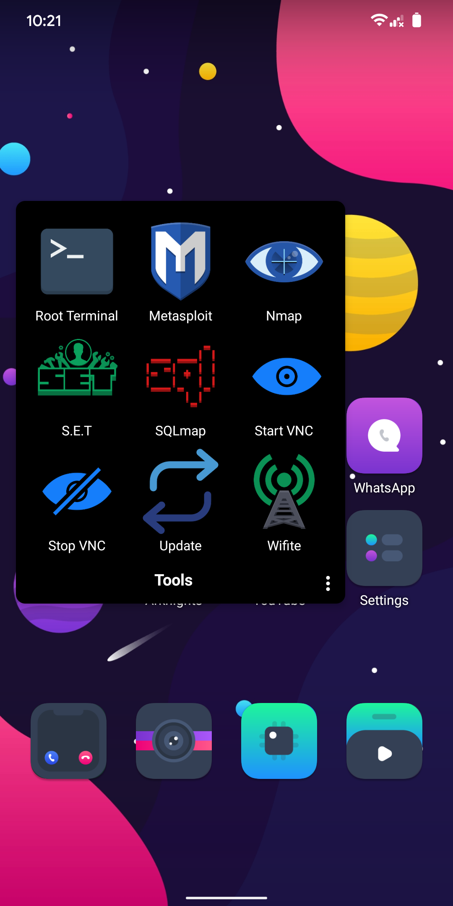
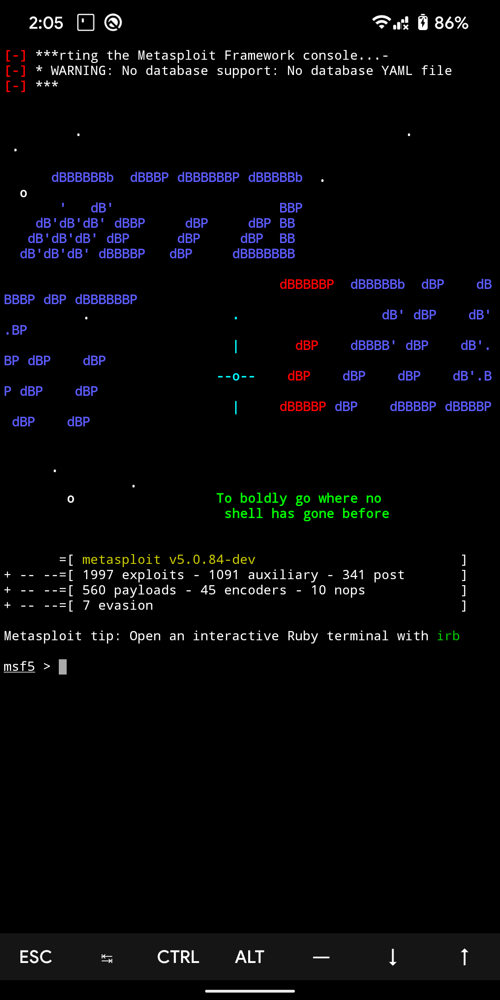
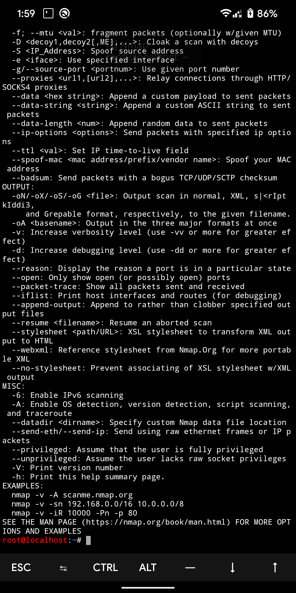
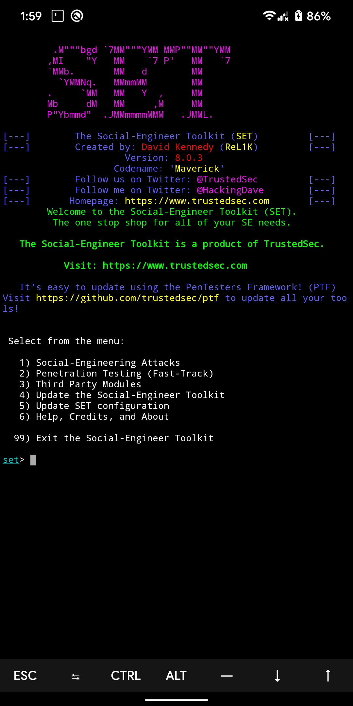
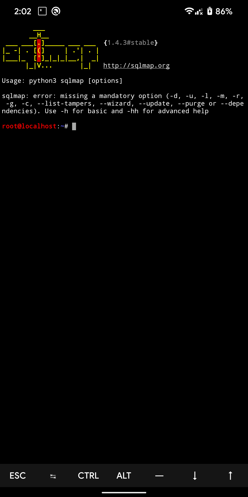

# Netroid - Nethunter on Homescreen


## How to Install
1. Install Termux:Widget on 'Termux Pack' folder
2. Open Termux, then run this command on your terminal
```bash
bash setup.sh 
```
Notes :
> To run this script, you must install Nethunter Rootless first, the installation tutorial is here : https://www.kali.org/docs/nethunter/nethunter-rootless/

> You have to change shortcut icons by yourself
> 
> Custom Icons available on 'Netroid Icons' folder
> 
> I recommend you to use 3rd party launcher like Nova launcher, Lawnchair launcher, Hyperion launcher, Etc.

## Screenshots
&nbsp;&nbsp;&nbsp;&nbsp;&nbsp;&nbsp;&nbsp;&nbsp;&nbsp;&nbsp;&nbsp;&nbsp;&nbsp;&nbsp;&nbsp;
